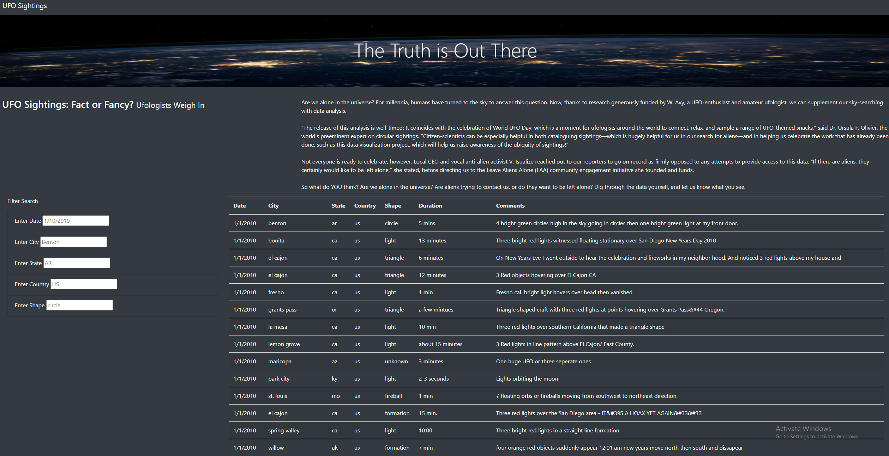

# UFOs

**Overview**

The purpose of this challenge was to create a website using Javascript. The website features information regarding UFOs, and having us ponder over whether we are indeed alone in the universe. Using Javascript, tables were created in order to filter through various UFO sitings. 

**Website Preview**

**Filtered Criteria**
The left-hand side filtering table allows you to type in and search various dates, cities, and/or states where a UFO sighting has occured. 

**Drawbacks & Recommendations**
Perhaps the filtering table would allow for users to search for months in a year? For example: 6/2010. Also, when it comes to recommendations, I think we could clear up and not make the NASA image so blurry in the background. Lastly, while everything is correctly formatted, I still think the placements of words and where everything is located is a bit jumbled. Clearing that up, and sectioning things off would perhaps make the website's appearance look more polished. 
